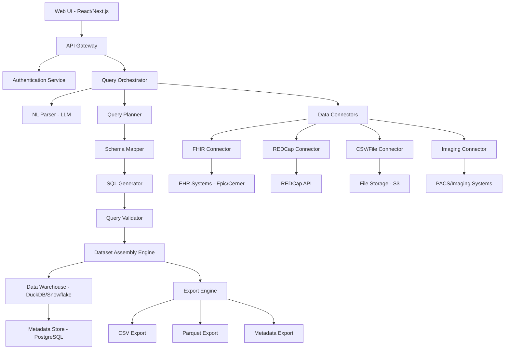
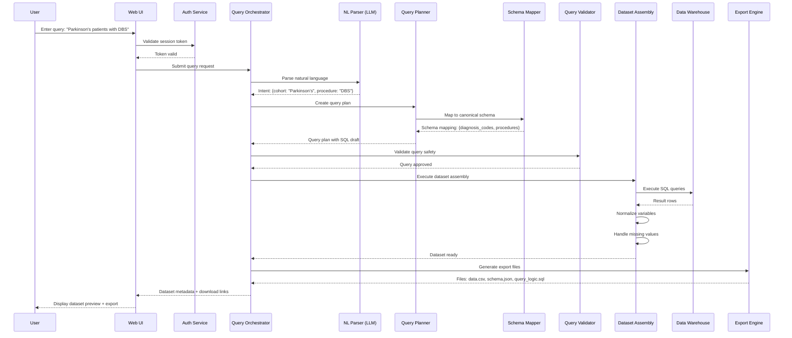
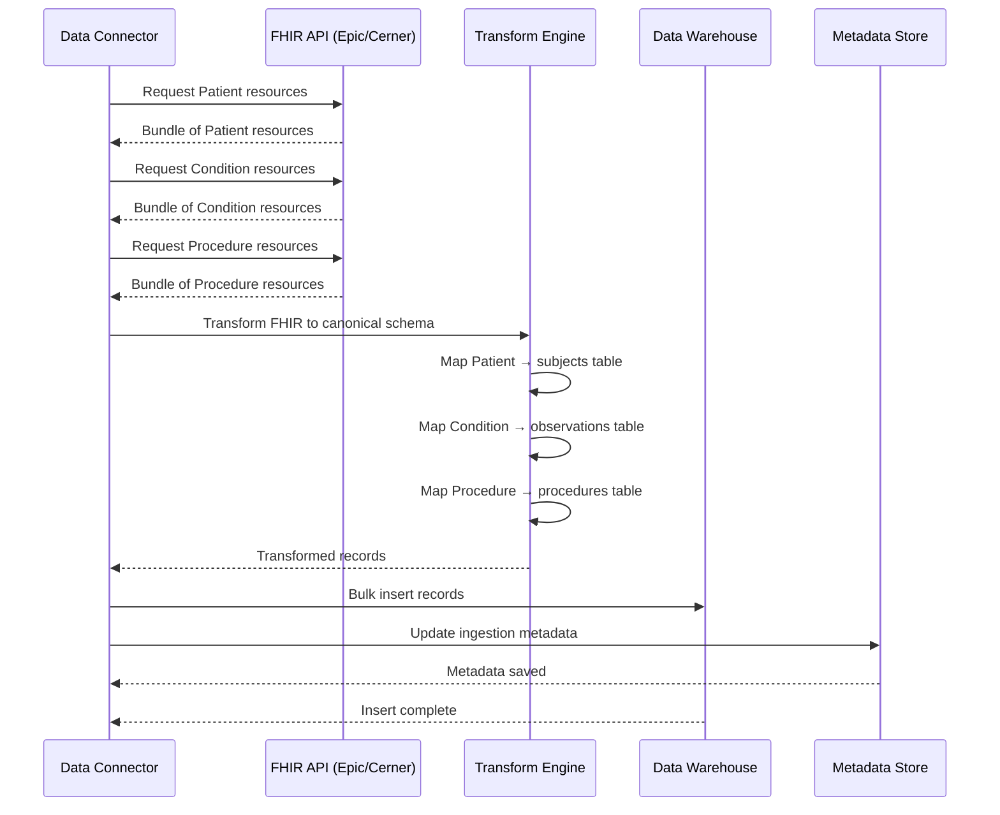

# Design Document: Research Dataset Builder

## Overview

The Research Dataset Builder is a platform that enables biomedical researchers to generate structured, analysis-ready datasets from fragmented multimodal data sources using natural language or structured queries. The system integrates clinical data (EHR via FHIR), research systems (REDCap, LIMS), imaging features, pathology outputs, and experimental data into cohesive datasets with reproducible query logic. The platform addresses the critical challenge of data fragmentation in translational research by providing an AI-powered query orchestrator that translates researcher intent into validated SQL queries, assembles multimodal datasets, and generates exportable tables with complete metadata and provenance tracking.

The system architecture follows a layered approach: a React/Next.js frontend with chat interface and dataset explorer, a FastAPI/Node.js backend for authentication and orchestration, a query engine that translates natural language to structured queries, data connectors for various sources (FHIR APIs, REDCap, CSV uploads), and a data warehouse (PostgreSQL for metadata, DuckDB/Snowflake/BigQuery for analytics). The platform ensures HIPAA compliance through encrypted storage, TLS transport, role-based access control, and comprehensive audit logging. The MVP focuses on CSV/REDCap uploads, schema mapping, natural language cohort queries, and dataset export, with future phases adding FHIR connectors and advanced multimodal integration.

## Architecture



## Sequence Diagrams

### Main Flow: Natural Language Query to Dataset Generation



### FHIR Data Ingestion Flow



## Components and Interfaces

### Component 1: Query Orchestrator

**Purpose**: Coordinates the entire query-to-dataset pipeline, managing natural language parsing, query planning, validation, execution, and dataset assembly.

**Interface**:
```lean
structure QueryRequest where
  userId : String
  queryText : String
  dataSourceIds : List String
  outputFormat : ExportFormat
  deriving Repr

inductive ExportFormat where
  | CSV
  | Parquet
  | JSON
  deriving Repr

structure QueryResponse where
  datasetId : String
  status : QueryStatus
  rowCount : Nat
  columnCount : Nat
  downloadUrls : List String
  metadata : DatasetMetadata
  deriving Repr

inductive QueryStatus where
  | Pending
  | Processing
  | Completed
  | Failed (error : String)
  deriving Repr

def QueryOrchestrator.processQuery (req : QueryRequest) : IO QueryResponse :=
  sorry
```

**Responsibilities**:
- Accept query requests from API gateway
- Coordinate NL parser, query planner, and dataset assembly
- Manage query execution lifecycle
- Return dataset metadata and download links
- Log all operations for audit trail


### Component 2: Natural Language Parser (LLM-Powered)

**Purpose**: Translates natural language queries into structured intent representations that can be used by the query planner.

**Interface**:
```lean
structure NLQuery where
  text : String
  context : Option QueryContext
  deriving Repr

structure QueryContext where
  availableDataSources : List String
  userHistory : List String
  deriving Repr

structure ParsedIntent where
  cohortCriteria : List CohortFilter
  variables : List VariableRequest
  timeRange : Option TimeRange
  confidence : Float
  deriving Repr

structure CohortFilter where
  filterType : FilterType
  field : String
  operator : ComparisonOp
  value : String
  deriving Repr

inductive FilterType where
  | Diagnosis
  | Procedure
  | Medication
  | Demographics
  | Observation
  deriving Repr

inductive ComparisonOp where
  | Equals
  | Contains
  | GreaterThan
  | LessThan
  | Between
  deriving Repr

def NLParser.parse (query : NLQuery) : IO ParsedIntent :=
  sorry
```

**Responsibilities**:
- Send natural language query to LLM API
- Extract cohort criteria, variables, and filters
- Return structured intent with confidence scores
- Handle ambiguous queries with clarification requests


### Component 3: Query Planner

**Purpose**: Converts parsed intent into executable query plans with optimized join strategies and data source selection.

**Interface**:
```lean
structure QueryPlan where
  steps : List QueryStep
  estimatedRows : Nat
  dataSources : List String
  sqlDraft : String
  deriving Repr

structure QueryStep where
  stepId : Nat
  operation : QueryOperation
  inputTables : List String
  outputTable : String
  deriving Repr

inductive QueryOperation where
  | Filter (condition : String)
  | Join (joinType : JoinType) (onCondition : String)
  | Aggregate (groupBy : List String) (aggregates : List String)
  | Transform (expression : String)
  deriving Repr

inductive JoinType where
  | Inner
  | LeftOuter
  | RightOuter
  | FullOuter
  deriving Repr

def QueryPlanner.createPlan (intent : ParsedIntent) (schema : SchemaMapping) : IO QueryPlan :=
  sorry
```

**Responsibilities**:
- Convert parsed intent to query plan
- Optimize join order and filter placement
- Estimate result set size
- Generate SQL draft for validation


### Component 4: Schema Mapper

**Purpose**: Maps between source schemas (FHIR, REDCap, CSV) and the canonical research schema.

**Interface**:
```lean
structure SchemaMapping where
  sourceSchema : String
  targetSchema : String
  fieldMappings : List FieldMapping
  deriving Repr

structure FieldMapping where
  sourcePath : String
  targetField : String
  transform : Option TransformFunction
  deriving Repr

inductive TransformFunction where
  | DateParse (format : String)
  | CodeLookup (codeSystem : String)
  | UnitConversion (fromUnit : String) (toUnit : String)
  | StringNormalize
  deriving Repr

def SchemaMapper.mapToCanonical (sourceData : List (String × String)) (mapping : SchemaMapping) : IO (List (String × String)) :=
  sorry

def SchemaMapper.inferMapping (sourceSchema : String) (targetSchema : String) : IO SchemaMapping :=
  sorry
```

**Responsibilities**:
- Maintain mappings between source and canonical schemas
- Transform data during ingestion
- Infer mappings for new data sources
- Handle FHIR resource mapping to relational tables


### Component 5: Dataset Assembly Engine

**Purpose**: Executes query plans, assembles results from multiple sources, normalizes data, and generates export files.

**Interface**:
```lean
structure AssemblyRequest where
  queryPlan : QueryPlan
  outputFormat : ExportFormat
  includeMetadata : Bool
  deriving Repr

structure AssembledDataset where
  datasetId : String
  rows : List (List String)
  schema : DatasetSchema
  metadata : DatasetMetadata
  queryProvenance : QueryProvenance
  deriving Repr

structure DatasetSchema where
  columns : List ColumnDefinition
  primaryKey : Option String
  deriving Repr

structure ColumnDefinition where
  name : String
  dataType : DataType
  nullable : Bool
  description : String
  deriving Repr

inductive DataType where
  | String
  | Integer
  | Float
  | Date
  | Boolean
  deriving Repr

structure DatasetMetadata where
  createdAt : String
  createdBy : String
  rowCount : Nat
  columnCount : Nat
  dataSources : List String
  deriving Repr

structure QueryProvenance where
  originalQuery : String
  parsedIntent : ParsedIntent
  sqlExecuted : String
  executionTime : Float
  deriving Repr

def DatasetAssembly.assemble (req : AssemblyRequest) : IO AssembledDataset :=
  sorry
```

**Responsibilities**:
- Execute SQL queries against data warehouse
- Merge results from multiple data sources
- Normalize variable names and handle missing values
- Generate metadata and provenance information
- Create export files in requested formats


### Component 6: FHIR Connector

**Purpose**: Connects to EHR systems via FHIR APIs, retrieves resources, and transforms them to canonical schema.

**Interface**:
```lean
structure FHIRConfig where
  baseUrl : String
  authToken : String
  version : String
  deriving Repr

inductive FHIRResource where
  | Patient
  | Condition
  | Procedure
  | Observation
  | MedicationRequest
  | DiagnosticReport
  | ImagingStudy
  | Encounter
  deriving Repr

structure FHIRQuery where
  resourceType : FHIRResource
  searchParams : List (String × String)
  pageSize : Nat
  deriving Repr

structure FHIRBundle where
  resourceType : String
  entries : List FHIREntry
  nextPageUrl : Option String
  deriving Repr

structure FHIREntry where
  resource : String  -- JSON representation
  deriving Repr

def FHIRConnector.query (config : FHIRConfig) (query : FHIRQuery) : IO FHIRBundle :=
  sorry

def FHIRConnector.transformToCanonical (bundle : FHIRBundle) (mapping : SchemaMapping) : IO (List (String × String)) :=
  sorry
```

**Responsibilities**:
- Authenticate with FHIR endpoints
- Execute FHIR search queries
- Handle pagination for large result sets
- Transform FHIR resources to canonical schema
- Cache frequently accessed resources


## Data Models

### Model 1: Canonical Research Schema - Subjects Table

```lean
structure Subject where
  subjectId : String
  dateOfBirth : Option String
  sex : Option String
  diagnosisCodes : List String
  studyGroup : Option String
  enrollmentDate : Option String
  deriving Repr

-- Validation rules encoded as predicates
def Subject.isValid (s : Subject) : Bool :=
  s.subjectId.length > 0 &&
  (s.sex.isNone || s.sex == some "M" || s.sex == some "F" || s.sex == some "O") &&
  s.diagnosisCodes.length >= 0

theorem subject_id_nonempty (s : Subject) (h : Subject.isValid s) : s.subjectId.length > 0 := by
  sorry
```

**Validation Rules**:
- subjectId must be non-empty string
- sex must be one of: M, F, O, or null
- diagnosisCodes must be valid ICD-10 or SNOMED codes
- dateOfBirth must be valid ISO 8601 date if present
- enrollmentDate must be after dateOfBirth if both present

### Model 2: Procedures Table

```lean
structure Procedure where
  procedureId : String
  subjectId : String
  procedureCode : String
  procedureName : String
  procedureDate : String
  performedBy : Option String
  deriving Repr

def Procedure.isValid (p : Procedure) : Bool :=
  p.procedureId.length > 0 &&
  p.subjectId.length > 0 &&
  p.procedureCode.length > 0 &&
  p.procedureDate.length > 0

theorem procedure_references_subject (p : Procedure) (subjects : List Subject) 
  (h : Procedure.isValid p) : ∃ s ∈ subjects, s.subjectId = p.subjectId := by
  sorry
```

**Validation Rules**:
- procedureId must be unique
- subjectId must reference valid subject
- procedureCode must be valid CPT or SNOMED code
- procedureDate must be valid ISO 8601 date
- procedureDate must be after subject's dateOfBirth


### Model 3: Observations Table

```lean
structure Observation where
  observationId : String
  subjectId : String
  observationType : String
  observationValue : String
  observationUnit : Option String
  observationDate : String
  deriving Repr

def Observation.isValid (o : Observation) : Bool :=
  o.observationId.length > 0 &&
  o.subjectId.length > 0 &&
  o.observationType.length > 0 &&
  o.observationDate.length > 0

def Observation.isNumeric (o : Observation) : Bool :=
  match o.observationValue.toFloat? with
  | some _ => true
  | none => false
```

**Validation Rules**:
- observationId must be unique
- subjectId must reference valid subject
- observationType must be valid LOINC code
- observationValue must match expected type for observationType
- observationUnit required for numeric observations
- observationDate must be valid ISO 8601 timestamp

### Model 4: Imaging Features Table

```lean
structure ImagingFeature where
  imagingId : String
  subjectId : String
  studyDate : String
  modality : ImagingModality
  features : List (String × Float)
  studyDescription : Option String
  deriving Repr

inductive ImagingModality where
  | MRI
  | CT
  | PET
  | Ultrasound
  | XRay
  deriving Repr

def ImagingFeature.isValid (i : ImagingFeature) : Bool :=
  i.imagingId.length > 0 &&
  i.subjectId.length > 0 &&
  i.studyDate.length > 0 &&
  i.features.length > 0
```

**Validation Rules**:
- imagingId must be unique
- subjectId must reference valid subject
- studyDate must be valid ISO 8601 date
- modality must be one of supported types
- features must be non-empty list of name-value pairs
- feature values must be valid floats


## Algorithmic Pseudocode

### Main Processing Algorithm: Query to Dataset Pipeline

```lean
def processQueryToDataset (req : QueryRequest) : IO QueryResponse := do
  -- Step 1: Validate user authentication and authorization
  let authResult ← validateAuth req.userId
  if not authResult.isValid then
    return QueryResponse.mk "" (QueryStatus.Failed "Unauthorized") 0 0 [] DatasetMetadata.empty
  
  -- Step 2: Parse natural language query
  let nlQuery := NLQuery.mk req.queryText none
  let parsedIntent ← NLParser.parse nlQuery
  
  -- Step 3: Validate confidence threshold
  if parsedIntent.confidence < 0.7 then
    return QueryResponse.mk "" (QueryStatus.Failed "Query ambiguous, please clarify") 0 0 [] DatasetMetadata.empty
  
  -- Step 4: Load schema mappings for requested data sources
  let schemaMappings ← loadSchemaMappings req.dataSourceIds
  
  -- Step 5: Create query plan
  let queryPlan ← QueryPlanner.createPlan parsedIntent schemaMappings
  
  -- Step 6: Validate query safety (no data modification, no infinite loops)
  let validationResult ← QueryValidator.validate queryPlan
  if not validationResult.isSafe then
    return QueryResponse.mk "" (QueryStatus.Failed validationResult.reason) 0 0 [] DatasetMetadata.empty
  
  -- Step 7: Execute dataset assembly
  let assemblyReq := AssemblyRequest.mk queryPlan req.outputFormat true
  let dataset ← DatasetAssembly.assemble assemblyReq
  
  -- Step 8: Generate export files
  let exportUrls ← ExportEngine.generateFiles dataset req.outputFormat
  
  -- Step 9: Log audit trail
  let _ ← AuditLog.record req.userId req.queryText dataset.datasetId
  
  -- Step 10: Return response
  return QueryResponse.mk 
    dataset.datasetId 
    QueryStatus.Completed 
    dataset.metadata.rowCount 
    dataset.metadata.columnCount 
    exportUrls 
    dataset.metadata

-- Preconditions:
-- • req.userId is valid and authenticated
-- • req.queryText is non-empty
-- • req.dataSourceIds contains at least one valid data source
-- • req.outputFormat is supported

-- Postconditions:
-- • If successful: QueryStatus.Completed and valid dataset files generated
-- • If failed: QueryStatus.Failed with descriptive error message
-- • Audit log entry created for all requests
-- • No data modification occurs (read-only operations)

-- Loop Invariants: N/A (no explicit loops in main algorithm)
```


### Cohort Identification Algorithm

```lean
def identifyCohort (criteria : List CohortFilter) (subjects : List Subject) : IO (List Subject) := do
  let mut matchingSubjects : List Subject := []
  
  -- Iterate through all subjects
  for subject in subjects do
    let mut matchesAll := true
    
    -- Check each filter criterion
    for filter in criteria do
      let matches ← evaluateFilter subject filter
      if not matches then
        matchesAll := false
        break
    
    -- Add subject if all criteria matched
    if matchesAll then
      matchingSubjects := subject :: matchingSubjects
  
  return matchingSubjects

-- Helper function to evaluate a single filter
def evaluateFilter (subject : Subject) (filter : CohortFilter) : IO Bool := do
  match filter.filterType with
  | FilterType.Diagnosis =>
      return subject.diagnosisCodes.contains filter.value
  | FilterType.Demographics =>
      match filter.field with
      | "sex" => return subject.sex == some filter.value
      | "age" => 
          let age ← calculateAge subject.dateOfBirth
          return evaluateComparison age filter.operator filter.value
      | _ => return false
  | FilterType.Procedure =>
      let procedures ← loadProcedures subject.subjectId
      return procedures.any (fun p => p.procedureCode == filter.value)
  | FilterType.Medication =>
      let medications ← loadMedications subject.subjectId
      return medications.any (fun m => m.medicationCode == filter.value)
  | FilterType.Observation =>
      let observations ← loadObservations subject.subjectId
      return observations.any (fun o => 
        o.observationType == filter.field && 
        evaluateComparison o.observationValue filter.operator filter.value)

-- Preconditions:
-- • criteria is non-empty list of valid filters
-- • subjects is list of validated Subject records
-- • All referenced data (procedures, medications, observations) is accessible

-- Postconditions:
-- • Returns subset of subjects matching ALL criteria (AND logic)
-- • Returned list maintains original subject order
-- • No subjects are modified
-- • Empty list returned if no matches found

-- Loop Invariants:
-- • matchingSubjects contains only subjects that matched all criteria checked so far
-- • All subjects in matchingSubjects have been fully validated
-- • No duplicate subjects in matchingSubjects
```


### FHIR Resource Transformation Algorithm

```lean
def transformFHIRToCanonical (bundle : FHIRBundle) (mapping : SchemaMapping) : IO (List Subject) := do
  let mut transformedSubjects : List Subject := []
  
  -- Process each FHIR resource in bundle
  for entry in bundle.entries do
    -- Parse JSON resource
    let resource ← parseJSON entry.resource
    
    -- Extract fields according to mapping
    let mut subjectData : List (String × String) := []
    
    for fieldMapping in mapping.fieldMappings do
      -- Extract value from FHIR resource using JSON path
      let sourceValue ← extractJSONPath resource fieldMapping.sourcePath
      
      -- Apply transformation if specified
      let transformedValue ← match fieldMapping.transform with
        | some (TransformFunction.DateParse fmt) => 
            parseDate sourceValue fmt
        | some (TransformFunction.CodeLookup codeSystem) => 
            lookupCode sourceValue codeSystem
        | some (TransformFunction.UnitConversion fromUnit toUnit) => 
            convertUnit sourceValue fromUnit toUnit
        | some TransformFunction.StringNormalize => 
            normalizeString sourceValue
        | none => 
            pure sourceValue
      
      -- Add to subject data
      subjectData := (fieldMapping.targetField, transformedValue) :: subjectData
    
    -- Construct Subject from field mappings
    let subject ← constructSubject subjectData
    
    -- Validate subject
    if Subject.isValid subject then
      transformedSubjects := subject :: transformedSubjects
    else
      -- Log validation error but continue processing
      let _ ← logError s!"Invalid subject data: {subject.subjectId}"
  
  return transformedSubjects

-- Preconditions:
-- • bundle contains valid FHIR resources
-- • mapping contains valid field mappings for FHIR → canonical schema
-- • All transformation functions are properly defined
-- • JSON parsing functions are available

-- Postconditions:
-- • Returns list of valid Subject records
-- • Invalid subjects are logged but not included in result
-- • All transformations applied correctly
-- • Original FHIR bundle is not modified

-- Loop Invariants:
-- • transformedSubjects contains only validated Subject records
-- • All subjects in transformedSubjects have passed isValid check
-- • Processing order matches bundle entry order
```


### Dataset Assembly with Missing Value Handling

```lean
def assembleDataset (cohort : List Subject) (variables : List VariableRequest) : IO AssembledDataset := do
  let mut rows : List (List String) := []
  let mut schema : List ColumnDefinition := []
  
  -- Step 1: Build schema from requested variables
  for variable in variables do
    let colDef := ColumnDefinition.mk 
      variable.name 
      variable.dataType 
      true  -- nullable
      variable.description
    schema := colDef :: schema
  
  -- Step 2: Collect data for each subject
  for subject in cohort do
    let mut row : List String := []
    
    -- Add subject ID first
    row := subject.subjectId :: row
    
    -- Collect each requested variable
    for variable in variables do
      let value ← match variable.source with
        | "subjects" => 
            extractSubjectField subject variable.field
        | "procedures" => 
            let procedures ← loadProcedures subject.subjectId
            aggregateProcedures procedures variable.field variable.aggregation
        | "observations" => 
            let observations ← loadObservations subject.subjectId
            aggregateObservations observations variable.field variable.aggregation
        | "imaging" => 
            let imaging ← loadImaging subject.subjectId
            extractImagingFeature imaging variable.field
        | _ => 
            pure ""
      
      -- Handle missing values
      let normalizedValue := if value.isEmpty then
        match variable.missingValueStrategy with
        | MissingStrategy.UseDefault => variable.defaultValue
        | MissingStrategy.UseNull => "NULL"
        | MissingStrategy.UseMean => calculateMean variable.field cohort
        | MissingStrategy.Exclude => ""  -- Will filter row later
      else
        value
      
      row := normalizedValue :: row
    
    -- Add row if not excluded due to missing values
    if not (row.any (· == "")) then
      rows := row :: rows
  
  -- Step 3: Create metadata
  let metadata := DatasetMetadata.mk
    (getCurrentTimestamp ())
    "system"
    rows.length
    schema.length
    ["subjects", "procedures", "observations", "imaging"]
  
  return AssembledDataset.mk
    (generateDatasetId ())
    rows
    (DatasetSchema.mk schema none)
    metadata
    QueryProvenance.empty

-- Preconditions:
-- • cohort is non-empty list of valid subjects
-- • variables is non-empty list of valid variable requests
-- • All data sources are accessible
-- • Missing value strategies are properly defined

-- Postconditions:
-- • Returns complete dataset with all requested variables
-- • Missing values handled according to specified strategy
-- • Schema matches requested variables
-- • Row count matches cohort size (minus excluded rows)
-- • All rows have same number of columns

-- Loop Invariants:
-- • rows contains only complete rows (no partial data)
-- • schema length matches number of columns in each row
-- • All values in rows are properly normalized
```


## Key Functions with Formal Specifications

### Function 1: validateQuerySafety()

```lean
def validateQuerySafety (plan : QueryPlan) : IO ValidationResult := do
  -- Check 1: No data modification operations
  for step in plan.steps do
    match step.operation with
    | QueryOperation.Filter _ => pure ()
    | QueryOperation.Join _ _ => pure ()
    | QueryOperation.Aggregate _ _ => pure ()
    | QueryOperation.Transform _ => pure ()
    -- Any other operation type would be rejected
  
  -- Check 2: No infinite loops or recursive queries
  let hasRecursion := detectRecursion plan.steps
  if hasRecursion then
    return ValidationResult.unsafe "Recursive queries not allowed"
  
  -- Check 3: Estimated result size within limits
  if plan.estimatedRows > 1000000 then
    return ValidationResult.unsafe "Result set too large (>1M rows)"
  
  -- Check 4: All referenced tables exist
  let allTables := plan.steps.flatMap (·.inputTables)
  for table in allTables do
    let exists ← tableExists table
    if not exists then
      return ValidationResult.unsafe s!"Table not found: {table}"
  
  return ValidationResult.safe

structure ValidationResult where
  isSafe : Bool
  reason : String
  deriving Repr

def ValidationResult.safe : ValidationResult :=
  { isSafe := true, reason := "" }

def ValidationResult.unsafe (msg : String) : ValidationResult :=
  { isSafe := false, reason := msg }
```

**Preconditions:**
- plan is a valid QueryPlan with non-empty steps
- plan.steps contains only supported QueryOperation types
- plan.estimatedRows is a non-negative integer

**Postconditions:**
- Returns ValidationResult with isSafe = true if all checks pass
- Returns ValidationResult with isSafe = false and descriptive reason if any check fails
- No side effects on input plan
- Function completes in bounded time (no infinite loops)

**Loop Invariants:**
- All previously checked steps contain only read operations
- All previously checked tables exist in the database


### Function 2: normalizeVariableNames()

```lean
def normalizeVariableNames (columns : List String) : List String :=
  columns.map normalizeColumn

def normalizeColumn (col : String) : String :=
  col.toLower
    |> replaceSpaces "_"
    |> removeSpecialChars
    |> ensureValidIdentifier

def replaceSpaces (s : String) (replacement : String) : String :=
  s.replace " " replacement

def removeSpecialChars (s : String) : String :=
  s.filter (fun c => c.isAlphanum || c == '_')

def ensureValidIdentifier (s : String) : String :=
  if s.isEmpty then "col"
  else if s.front.isDigit then s!"col_{s}"
  else s

-- Example: "Patient Age (years)" → "patient_age_years"
-- Example: "123_test" → "col_123_test"
```

**Preconditions:**
- columns is a list of strings (may be empty)
- Each string in columns represents a column name (may contain any characters)

**Postconditions:**
- Returns list of normalized column names
- All returned names are valid SQL identifiers
- All returned names are lowercase
- Spaces replaced with underscores
- Special characters removed
- Names starting with digits prefixed with "col_"
- Empty strings replaced with "col"
- List length unchanged
- Order preserved

**Loop Invariants:**
- All processed columns are valid SQL identifiers
- No duplicate names introduced (unless duplicates existed in input)


### Function 3: generateReproducibleQuery()

```lean
def generateReproducibleQuery (intent : ParsedIntent) (plan : QueryPlan) (metadata : DatasetMetadata) : String := do
  let header := s!"-- Dataset Query\n-- Generated: {metadata.createdAt}\n-- Created by: {metadata.createdBy}\n\n"
  
  let cohortSQL := generateCohortSQL intent.cohortCriteria
  let variablesSQL := generateVariablesSQL intent.variables
  let joinsSQL := generateJoinsSQL plan.steps
  
  let fullQuery := s!"{header}-- Cohort Definition\n{cohortSQL}\n\n-- Variable Collection\n{variablesSQL}\n\n-- Joins\n{joinsSQL}"
  
  return fullQuery

def generateCohortSQL (criteria : List CohortFilter) : String :=
  let conditions := criteria.map filterToSQL
  let whereClause := String.intercalate " AND " conditions
  s!"SELECT subject_id FROM subjects WHERE {whereClause}"

def filterToSQL (filter : CohortFilter) : String :=
  match filter.filterType with
  | FilterType.Diagnosis =>
      s!"'{filter.value}' = ANY(diagnosis_codes)"
  | FilterType.Demographics =>
      s!"{filter.field} {operatorToSQL filter.operator} '{filter.value}'"
  | FilterType.Procedure =>
      s!"subject_id IN (SELECT subject_id FROM procedures WHERE procedure_code = '{filter.value}')"
  | _ => ""

def operatorToSQL (op : ComparisonOp) : String :=
  match op with
  | ComparisonOp.Equals => "="
  | ComparisonOp.Contains => "LIKE"
  | ComparisonOp.GreaterThan => ">"
  | ComparisonOp.LessThan => "<"
  | ComparisonOp.Between => "BETWEEN"
```

**Preconditions:**
- intent contains valid parsed intent with cohort criteria and variables
- plan contains valid query plan with executable steps
- metadata contains valid dataset metadata

**Postconditions:**
- Returns valid SQL query string
- Query is executable against the data warehouse
- Query includes comments with generation metadata
- Query produces same results when re-executed
- Query is human-readable and well-formatted

**Loop Invariants:** N/A (uses map operations, no explicit loops)


## Example Usage

### Example 1: Basic Natural Language Query

```lean
-- User submits query
def example1 : IO Unit := do
  let request := QueryRequest.mk
    "user123"
    "Find all Parkinson's patients with DBS surgery"
    ["clinical_db", "procedures_db"]
    ExportFormat.CSV
  
  let response ← QueryOrchestrator.processQuery request
  
  match response.status with
  | QueryStatus.Completed =>
      IO.println s!"Dataset ready: {response.datasetId}"
      IO.println s!"Rows: {response.rowCount}, Columns: {response.columnCount}"
      IO.println s!"Download: {response.downloadUrls.head!}"
  | QueryStatus.Failed err =>
      IO.println s!"Query failed: {err}"
  | _ =>
      IO.println "Query processing..."
```

### Example 2: Complex Multimodal Query

```lean
-- Query with imaging and medication data
def example2 : IO Unit := do
  let request := QueryRequest.mk
    "researcher456"
    "Parkinson's patients with DBS, MRI within 6 months post-op, and levodopa medication history"
    ["clinical_db", "procedures_db", "imaging_db", "medications_db"]
    ExportFormat.Parquet
  
  let response ← QueryOrchestrator.processQuery request
  
  -- Expected parsed intent:
  -- cohortCriteria: [
  --   {filterType: Diagnosis, field: "diagnosis_codes", value: "G20"},
  --   {filterType: Procedure, field: "procedure_code", value: "DBS"}
  -- ]
  -- variables: [
  --   {source: "imaging", field: "mri_features", timeConstraint: "6 months post procedure"},
  --   {source: "medications", field: "levodopa", aggregation: "history"}
  -- ]
  
  IO.println s!"Dataset: {response.datasetId}"
  IO.println s!"Subjects: {response.rowCount}"
```

### Example 3: FHIR Data Ingestion

```lean
-- Ingest FHIR data from Epic
def example3 : IO Unit := do
  let config := FHIRConfig.mk
    "https://fhir.epic.com/api/FHIR/R4"
    "Bearer abc123..."
    "R4"
  
  let query := FHIRQuery.mk
    FHIRResource.Patient
    [("_has:Condition:patient:code", "G20")]  -- Parkinson's diagnosis
    100
  
  let bundle ← FHIRConnector.query config query
  
  let mapping ← SchemaMapper.inferMapping "FHIR_R4_Patient" "canonical_subjects"
  
  let subjects ← FHIRConnector.transformToCanonical bundle mapping
  
  IO.println s!"Ingested {subjects.length} subjects"
```


### Example 4: Dataset Assembly with Missing Value Handling

```lean
-- Assemble dataset with different missing value strategies
def example4 : IO Unit := do
  let cohort ← identifyCohort 
    [CohortFilter.mk FilterType.Diagnosis "diagnosis_codes" ComparisonOp.Contains "G20"]
    allSubjects
  
  let variables := [
    VariableRequest.mk "age" DataType.Integer "subjects" "date_of_birth" none MissingStrategy.Exclude "",
    VariableRequest.mk "levodopa_dose" DataType.Float "medications" "dose" (some "mean") MissingStrategy.UseMean "0",
    VariableRequest.mk "mri_volume" DataType.Float "imaging" "brain_volume" none MissingStrategy.UseNull ""
  ]
  
  let dataset ← assembleDataset cohort variables
  
  IO.println s!"Dataset assembled: {dataset.rows.length} rows, {dataset.schema.columns.length} columns"
  IO.println s!"Missing value strategies applied successfully"
```

## Correctness Properties

### Property 1: Query Safety Invariant

```lean
-- All executed queries must be read-only and cannot modify data
theorem query_safety (plan : QueryPlan) (result : ValidationResult) :
  result = validateQuerySafety plan →
  result.isSafe = true →
  ∀ step ∈ plan.steps, isReadOnlyOperation step.operation := by
  sorry

def isReadOnlyOperation (op : QueryOperation) : Bool :=
  match op with
  | QueryOperation.Filter _ => true
  | QueryOperation.Join _ _ => true
  | QueryOperation.Aggregate _ _ => true
  | QueryOperation.Transform _ => true
```

### Property 2: Cohort Consistency

```lean
-- All subjects in a cohort must satisfy ALL filter criteria
theorem cohort_consistency (criteria : List CohortFilter) (subjects : List Subject) (cohort : List Subject) :
  cohort = identifyCohort criteria subjects →
  ∀ s ∈ cohort, ∀ f ∈ criteria, evaluateFilter s f = true := by
  sorry
```

### Property 3: Schema Completeness

```lean
-- Every row in assembled dataset must have exactly the same number of columns as schema
theorem schema_completeness (dataset : AssembledDataset) :
  ∀ row ∈ dataset.rows, row.length = dataset.schema.columns.length := by
  sorry
```

### Property 4: Data Provenance Preservation

```lean
-- Every dataset must maintain complete provenance information
theorem provenance_preservation (dataset : AssembledDataset) :
  dataset.queryProvenance.originalQuery.length > 0 ∧
  dataset.queryProvenance.sqlExecuted.length > 0 ∧
  dataset.metadata.dataSources.length > 0 := by
  sorry
```

### Property 5: FHIR Transformation Validity

```lean
-- All transformed FHIR resources must pass validation
theorem fhir_transformation_validity (bundle : FHIRBundle) (mapping : SchemaMapping) (subjects : List Subject) :
  subjects = transformFHIRToCanonical bundle mapping →
  ∀ s ∈ subjects, Subject.isValid s = true := by
  sorry
```

### Property 6: Referential Integrity

```lean
-- All foreign key references must be valid
theorem referential_integrity (procedures : List Procedure) (subjects : List Subject) :
  ∀ p ∈ procedures, ∃ s ∈ subjects, s.subjectId = p.subjectId := by
  sorry
```


## Error Handling

### Error Scenario 1: Invalid FHIR Authentication

**Condition**: FHIR API returns 401 Unauthorized or 403 Forbidden
**Response**: 
- Catch authentication error in FHIRConnector
- Return error response with message "FHIR authentication failed"
- Log error with timestamp and endpoint
- Do not retry automatically (credentials likely invalid)

**Recovery**: 
- User must update FHIR credentials in configuration
- System provides link to credential management page
- Admin notification sent if multiple failures occur

### Error Scenario 2: Query Timeout

**Condition**: Query execution exceeds 5 minute timeout
**Response**:
- Cancel query execution
- Return QueryStatus.Failed with "Query timeout exceeded"
- Log query plan and estimated rows for analysis
- Suggest query optimization or data source filtering

**Recovery**:
- User can refine query to reduce scope
- System suggests adding filters or reducing time range
- Admin can increase timeout for specific users/queries

### Error Scenario 3: Schema Mapping Failure

**Condition**: Cannot map source schema to canonical schema
**Response**:
- Return error with unmapped fields listed
- Provide schema inference suggestions
- Allow user to manually specify mappings
- Log schema mismatch for future improvement

**Recovery**:
- User provides manual field mappings via UI
- System learns from manual mappings for future inference
- Admin can create reusable mapping templates

### Error Scenario 4: Data Validation Failure

**Condition**: Ingested data fails validation rules
**Response**:
- Log validation errors with row numbers and field names
- Continue processing valid records
- Generate validation report
- Return partial dataset with error summary

**Recovery**:
- User reviews validation report
- User can fix source data and re-ingest
- User can adjust validation rules if appropriate
- Invalid records quarantined for manual review

### Error Scenario 5: Missing Required Data

**Condition**: Required variable has no data for subject
**Response**:
- Apply missing value strategy (exclude, use default, use mean)
- Log missing data statistics
- Include missing data report in metadata
- Warn user if missing data exceeds threshold (>20%)

**Recovery**:
- User can change missing value strategy
- User can exclude subjects with missing data
- User can impute values using statistical methods
- System suggests alternative data sources


## Testing Strategy

### Unit Testing Approach

**Core Components to Test**:
- NLParser: Test intent extraction from various natural language queries
- QueryPlanner: Test query plan generation for different cohort criteria
- SchemaMapper: Test field mapping transformations
- QueryValidator: Test safety checks for malicious or invalid queries
- DatasetAssembly: Test dataset construction with various missing value strategies
- FHIRConnector: Test FHIR resource parsing and transformation

**Key Test Cases**:
1. Valid natural language queries produce correct parsed intent
2. Invalid queries return appropriate error messages
3. Query plans generate valid SQL
4. Schema mappings handle all supported data types
5. Validation rejects data modification queries
6. Missing value strategies applied correctly
7. FHIR resources transform to canonical schema
8. Referential integrity maintained across tables

**Coverage Goals**: 
- 90% code coverage for core business logic
- 100% coverage for security-critical validation functions
- All error paths tested

### Property-Based Testing Approach

**Property Test Library**: fast-check (for TypeScript/JavaScript) or Hypothesis (for Python)

**Properties to Test**:

1. **Query Safety Property**: All generated query plans must be read-only
   - Generate random QueryPlan instances
   - Verify validateQuerySafety returns safe for all read operations
   - Verify validateQuerySafety rejects any modification operations

2. **Cohort Consistency Property**: All cohort members satisfy all criteria
   - Generate random cohort criteria and subject lists
   - Verify identifyCohort returns only matching subjects
   - Verify no false positives or false negatives

3. **Schema Completeness Property**: All rows have same column count
   - Generate random datasets with various schemas
   - Verify every row has exactly schema.columns.length values
   - Verify no missing or extra columns

4. **Normalization Idempotency**: Normalizing twice produces same result
   - Generate random column names
   - Verify normalizeVariableNames(normalizeVariableNames(x)) == normalizeVariableNames(x)

5. **FHIR Transformation Validity**: All transformed subjects are valid
   - Generate random FHIR bundles
   - Verify all transformed subjects pass Subject.isValid
   - Verify no data loss during transformation

6. **Referential Integrity Property**: All foreign keys reference existing records
   - Generate random procedures and subjects
   - Verify every procedure.subjectId exists in subjects list
   - Verify no orphaned records

**Property Test Configuration**:
- Run 1000 test cases per property
- Use shrinking to find minimal failing examples
- Seed random generator for reproducibility


### Integration Testing Approach

**Integration Test Scenarios**:

1. **End-to-End Query Flow**:
   - Submit natural language query via API
   - Verify query orchestration through all components
   - Verify dataset generation and export
   - Verify audit log creation
   - Expected: Complete dataset with metadata

2. **FHIR Data Ingestion**:
   - Connect to FHIR test server
   - Ingest Patient, Condition, Procedure resources
   - Verify transformation to canonical schema
   - Verify data warehouse population
   - Expected: All FHIR data accessible via queries

3. **Multi-Source Dataset Assembly**:
   - Query data from clinical DB, imaging DB, and REDCap
   - Verify joins across data sources
   - Verify variable collection from each source
   - Expected: Unified dataset with all requested variables

4. **Authentication and Authorization**:
   - Test valid and invalid authentication tokens
   - Test role-based access control
   - Verify audit logging for all access attempts
   - Expected: Proper access control enforcement

5. **Error Recovery**:
   - Simulate FHIR API timeout
   - Simulate database connection failure
   - Simulate invalid query syntax
   - Verify graceful error handling and user feedback
   - Expected: Appropriate error messages, no data corruption

**Test Environment**:
- Isolated test database with synthetic data
- Mock FHIR server with test resources
- Test user accounts with various permission levels
- Automated test execution in CI/CD pipeline

## Performance Considerations

**Query Execution Performance**:
- Target: 95% of queries complete within 30 seconds
- Optimization: Use query plan caching for repeated queries
- Optimization: Implement result pagination for large datasets
- Optimization: Use database indexes on frequently filtered columns
- Monitoring: Track query execution time and identify slow queries

**Data Ingestion Performance**:
- Target: Ingest 10,000 FHIR resources per minute
- Optimization: Batch insert operations (1000 records per batch)
- Optimization: Parallel processing of FHIR bundles
- Optimization: Use bulk FHIR export when available
- Monitoring: Track ingestion rate and identify bottlenecks

**Dataset Assembly Performance**:
- Target: Assemble datasets with 100,000 rows in under 2 minutes
- Optimization: Use columnar storage (Parquet) for analytics
- Optimization: Implement incremental dataset updates
- Optimization: Cache frequently accessed aggregations
- Monitoring: Track assembly time by dataset size

**Scalability Targets**:
- Support 1000 concurrent users
- Handle 10 million subjects in data warehouse
- Process 100 queries per minute
- Store 1 TB of multimodal data


## Security Considerations

**HIPAA Compliance Requirements**:

1. **Data Encryption**:
   - At rest: AES-256 encryption for all databases and file storage
   - In transit: TLS 1.3 for all API communications
   - Key management: AWS KMS or Azure Key Vault for encryption keys
   - Backup encryption: All backups encrypted with separate keys

2. **Access Control**:
   - Authentication: SSO integration with hospital identity provider (OAuth2/SAML)
   - Authorization: Role-based access control (RBAC) with principle of least privilege
   - Roles: Admin, Researcher, Data Analyst, Read-Only
   - Session management: 30-minute timeout, secure session tokens
   - Multi-factor authentication: Required for admin access

3. **Audit Logging**:
   - Log all data access: user, timestamp, query, data accessed
   - Log all dataset generation: cohort size, variables, export format
   - Log all authentication attempts: successful and failed
   - Log retention: 7 years for HIPAA compliance
   - Tamper-proof logs: Write-once storage with integrity verification

4. **Data Minimization**:
   - Only collect necessary data for research purposes
   - Implement data retention policies (delete after study completion)
   - Support de-identification and anonymization
   - Provide data usage reports for compliance audits

5. **Network Security**:
   - VPC isolation for data warehouse and processing
   - Private endpoints for FHIR connections
   - IP whitelisting for administrative access
   - DDoS protection and rate limiting
   - Web application firewall (WAF) for API gateway

**Threat Model**:

1. **Threat: SQL Injection**
   - Mitigation: Use parameterized queries exclusively
   - Mitigation: Validate all user input
   - Mitigation: Query validator rejects suspicious patterns

2. **Threat: Unauthorized Data Access**
   - Mitigation: RBAC enforcement at API and database levels
   - Mitigation: Row-level security based on user permissions
   - Mitigation: Audit all access attempts

3. **Threat: Data Exfiltration**
   - Mitigation: Rate limiting on dataset exports
   - Mitigation: Watermarking for exported datasets
   - Mitigation: Alert on large or unusual exports

4. **Threat: LLM Prompt Injection**
   - Mitigation: Sanitize natural language queries
   - Mitigation: Validate LLM output before execution
   - Mitigation: Limit LLM to intent parsing only (no direct data access)

5. **Threat: Insider Threat**
   - Mitigation: Comprehensive audit logging
   - Mitigation: Separation of duties for admin functions
   - Mitigation: Regular access reviews and permission audits


## Dependencies

### Frontend Dependencies
- **React 18+**: UI framework for web application
- **Next.js 14+**: React framework with SSR and API routes
- **TypeScript 5+**: Type-safe JavaScript
- **TanStack Query**: Data fetching and caching
- **Recharts**: Data visualization library
- **Tailwind CSS**: Utility-first CSS framework
- **Zod**: Schema validation for forms

### Backend Dependencies
- **FastAPI 0.100+** (Python) or **NestJS 10+** (Node.js): API framework
- **Pydantic** (Python) or **class-validator** (Node.js): Data validation
- **SQLAlchemy** (Python) or **Prisma** (Node.js): ORM for PostgreSQL
- **Celery** (Python) or **Bull** (Node.js): Task queue for async processing
- **Redis**: Cache and task queue backend

### Data Layer Dependencies
- **PostgreSQL 15+**: Metadata store and relational database
- **DuckDB 0.9+** (MVP) or **Snowflake/BigQuery** (Production): Analytics data warehouse
- **Apache Arrow**: Columnar data format for efficient processing
- **Parquet**: File format for dataset exports

### AI/LLM Dependencies
- **OpenAI API** or **Anthropic Claude API**: Natural language parsing
- **LangChain**: LLM orchestration and prompt management
- **tiktoken**: Token counting for LLM requests

### FHIR Dependencies
- **fhir.resources** (Python) or **fhir-kit-client** (Node.js): FHIR client library
- **FHIR R4 specification**: Standard for healthcare data exchange

### Security Dependencies
- **OAuth2/SAML libraries**: SSO integration
- **bcrypt**: Password hashing (if local auth used)
- **JWT**: Token-based authentication
- **AWS KMS SDK** or **Azure Key Vault SDK**: Encryption key management

### Infrastructure Dependencies
- **Docker**: Containerization
- **Kubernetes** or **AWS ECS**: Container orchestration
- **AWS S3** or **Azure Blob Storage**: File storage
- **CloudWatch** or **Azure Monitor**: Logging and monitoring
- **Terraform**: Infrastructure as code

### Development Dependencies
- **pytest** (Python) or **Jest** (Node.js): Unit testing
- **Hypothesis** (Python) or **fast-check** (Node.js): Property-based testing
- **Black** (Python) or **Prettier** (Node.js): Code formatting
- **Ruff** (Python) or **ESLint** (Node.js): Linting
- **pre-commit**: Git hooks for code quality

### External Services
- **EHR Systems**: Epic (FHIR API), Cerner/Oracle Health (FHIR API)
- **REDCap**: Research data capture system
- **PACS**: Picture archiving and communication system (for imaging)
- **Hospital Identity Provider**: SSO authentication
